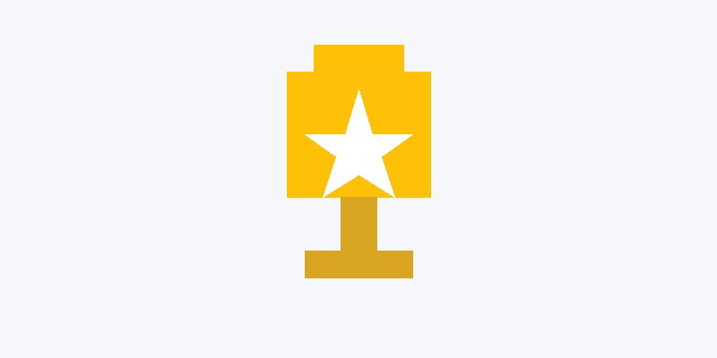

I am a final-year Accounting and Finance student at Dublin City University, specialising in Data Analytics and Finance. Throughout my studies, I have developed a strong interest in financial markets, investments, and trading, and I enjoy combining analytical thinking with practical decision-making. My academic path has allowed me to build a solid foundation in finance while also strengthening my skills in data analysis, financial modelling, and problem-solving.

My interest in finance began at an early age, when I started investing at 15 and became increasingly curious about how markets work. Since then, I have continued to deepen my understanding of economics and financial markets, both through my university studies and through independent learning. Over time, this interest has grown into a genuine passion, especially in the areas of investing, trading, and market analysis. I am particularly interested in understanding how economic developments influence financial markets and investment decisions.

Alongside my academic background, I have also gained practical experience in professional and customer-facing environments. During my internship at PwC in the Tax Financial Services department, I worked on real client cases, supported financial data analysis, researched tax legislation, and contributed to testing AI tools in practice. This experience helped me improve both my technical and communication skills, while also showing me the importance of working effectively within a professional team.

Before and during university, I also worked in roles that strengthened my communication, adaptability, and responsibility. Working in retail and hospitality taught me how to interact with different people, solve problems independently, and stay effective in fast-paced environments. These experiences have shaped me not only as a student, but also as a person who is motivated, reliable, and always willing to learn.

What motivates me most is continuous growth — both personal and professional. Moving to Ireland to study, adapting to a new environment, and pursuing strong academic results have all pushed me to develop resilience and ambition. Through this ePortfolio, I would like to share more about my background, achievements, interests, and the projects that reflect my journey so far.

---

## Curriculum Vitae

You can download my CV below or access it anytime from the navigation bar.

[Download CV (PDF)](assets/cv.pdf){.btn .btn-primary target="_blank"}

---

[{fig-alt="Trophy representing achievements and accomplishments"}](achievements.qmd)

### [Achievements](achievements.qmd)

Discover my academic and professional accomplishments, awards, and certifications.
