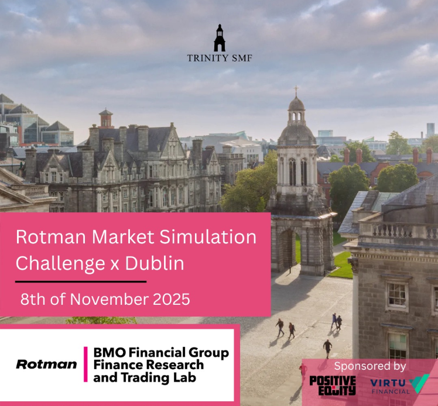
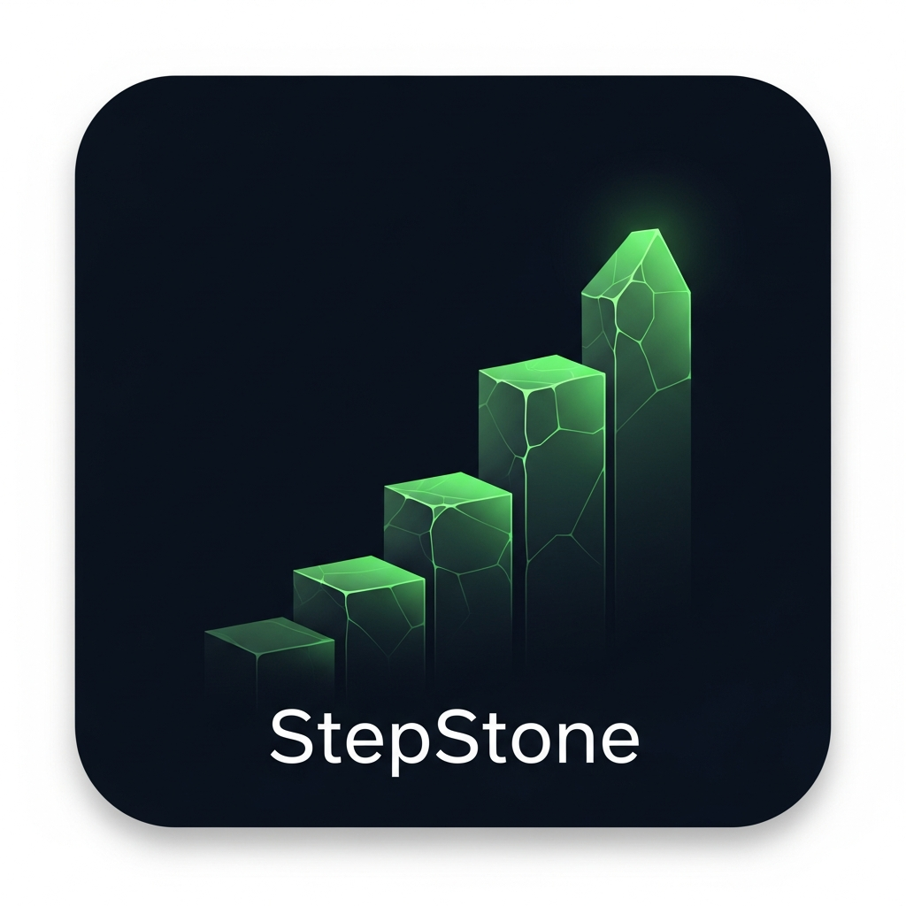
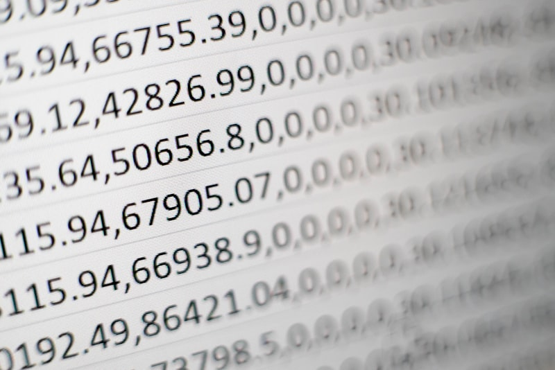
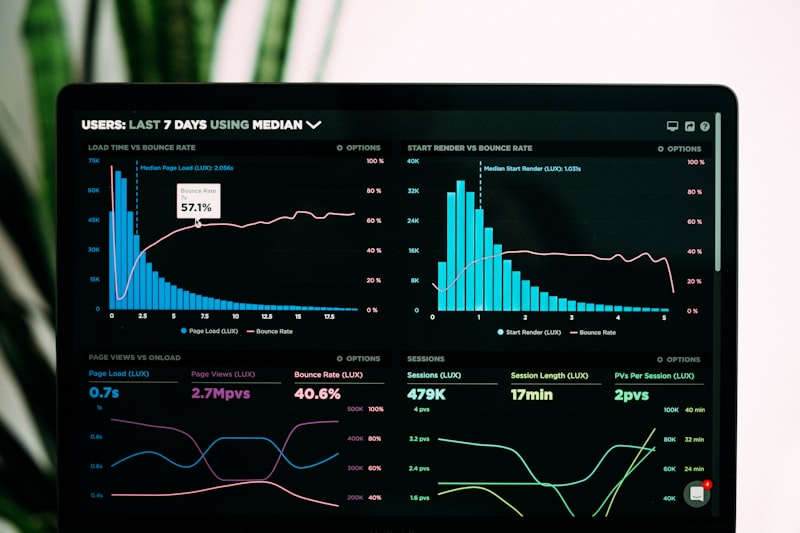

<h1>Daniel Vala</h1>

<a href="https://www.linkedin.com/in/daniel-vala-0a6b132b9" target="_blank"><i class="bi bi-linkedin"></i> LinkedIn</a>
<a href="https://github.com/DangerX347" target="_blank"><i class="bi bi-github"></i> GitHub</a>
<a href="mailto:daniel.vala2@mail.dcu.ie"><i class="bi bi-envelope"></i> Email</a>

**Welcome to my ePortfolio!**

In this ePortfolio, you can learn more about me, my past experiences, achievements, and interests. You will also find some of my academic projects here, which highlight my learning journey and the areas I am passionate about.

Feel free to explore the website to whatever extent you like, and do not hesitate to reach out if you have any questions.

# About Me

I am a final-year Accounting and Finance student at Dublin City University, specialising in Data Analytics and Finance. Throughout my studies, I have developed a strong interest in financial markets, investments, and trading, and I enjoy combining analytical thinking with practical decision-making. My academic path has allowed me to build a solid foundation in finance while also strengthening my skills in data analysis, financial modelling, and problem-solving.

:::: {.about-cards}

::: {.about-card}
### Interests

My interest in finance began at an early age, when I started investing at 15 and became increasingly curious about how markets work. Since then, I have continued to deepen my understanding of economics and financial markets, both through my university studies and through independent learning. Over time, this interest has grown into a genuine passion, especially in the areas of investing, trading, and market analysis. I am particularly interested in understanding how economic developments influence financial markets and investment decisions.
:::

::: {.about-card}
### PwC Experience

Alongside my academic background, I have also gained practical experience in professional and customer-facing environments. During my internship at PwC in the Tax Financial Services department, I worked on real client cases, supported financial data analysis, researched tax legislation, and contributed to testing AI tools in practice. This experience helped me improve both my technical and communication skills, while also showing me the importance of working effectively within a professional team.
:::

::: {.about-card}
### Retail Experience

Before and during university, I also worked in roles that strengthened my communication, adaptability, and responsibility. Working in retail and hospitality taught me how to interact with different people, solve problems independently, and stay effective in fast-paced environments. These experiences have shaped me not only as a student, but also as a person who is motivated, reliable, and always willing to learn.
:::

::::

<a href="assets/cv.pdf" target="_blank" class="cv-download-btn"><i class="bi bi-file-earmark-pdf"></i> Download CV</a>

<h1 style="text-align: center; margin-top: 5rem;" id="achievements">Achievements</h1>

Throughout my academic and personal journey, I have had the opportunity to participate in several competitions and earn recognition for my work. Below are some of the achievements I am most proud of.

<h3>Economics Olympiad</h3>
<strong>13th place in the National Final | 2022</strong>

In 2022, I competed in the Economics Olympiad in the Czech Republic, a prestigious competition running across 22 countries. After passing both the school and regional rounds, I reached the National Final hosted by the Czech National Bank, where I placed 13th out of over 30,000 competitors nationwide. This experience deepened my understanding of economics and confirmed my passion for the field.

<h3>Secondary School Research Competition</h3>
<strong>4th place in Moravia | 2022</strong>

In the same year, I achieved 4th place in the Moravian round of the Secondary School Research Competition (Středoškolská Odborná Činnost). My project focused on the economic aspects of Bitcoin and its comparison to fiat currencies. As part of the research, I conducted interviews with two leading Czech economists and defended my findings in front of an expert jury.

<h3>Trinity SMF x Rotman National Market Challenge</h3>
<strong>7th place in Ireland | 2025</strong>

In 2025, I took part in the Rotman Market Simulation Challenge hosted by Trinity SMF in Dublin. Together with my teammate, we placed 7th in Ireland, competing in a fast-paced trading simulation that tested our understanding of market behaviour and ability to make split-second decisions. The experience gave me valuable insights into institutional trading dynamics.

<h3>PwC Award for Financial Accounting</h3>
<strong>Top 10 in class | 2024</strong>

In 2024, I was recognised with the PwC Award for my performance in the Financial Accounting module at DCU, placing in the top 10 in my class. This achievement reflects my dedication to understanding financial reporting standards, IFRS, and the preparation of financial statements.

# Projects {#projects}

This page showcases the projects I have completed during my studies. Together, they reflect a range of skills, including coding, economic analysis, applying tools to real-world case studies, and video editing.

:::: {.project-grid}

::: {.project-card}
[{fig-alt="StepStone logo"}](projects/list/econometrics-project.html)

**[FinTech Product Pitch: StepStone](projects/list/econometrics-project.html)**

Conceptualising a FinTech app for Irish students and supporting it with econometric analysis and forecasting.
:::

::: {.project-card}
[{fig-alt="Machine Learning"}](projects/list/project-sql-python.html)

**[Machine Learning Project](projects/list/project-sql-python.html)**

A machine learning project demonstrating data analysis, SQL queries, and Python visualisation skills.
:::

::: {.project-card}
[{fig-alt="Business Strategy"}](projects/list/business-strategy-project.html)

**[Business Strategy Case Study: Lyten](projects/list/business-strategy-project.html)**

A strategic analysis of Lyten's acquisition of Northvolt assets and its cross-border expansion in the battery industry.
:::

::: {.project-card}
[{fig-alt="Macroeconomic Analysis"}](projects/list/macroeconomic-project.html)

**[Macroeconomic Analysis of Nicaragua](projects/list/macroeconomic-project.html)**

An in-depth analysis of Nicaragua's macroeconomic conditions, fiscal and monetary policy.
:::

::: {.project-card}
[{fig-alt="Power BI Dashboard"}](projects/list/coding-visualisation-project.html)

**[Global Profitability Analysis: EcoEnergy Corp](projects/list/coding-visualisation-project.html)**

A Power BI group project analysing regional profitability and developing outsourcing recommendations.
:::

::: {.project-card}
[{fig-alt="Bitcoin Standard"}](projects/list/soc-bitcoin-project.html)

**[The Bitcoin Standard: An Economic Analysis](projects/list/soc-bitcoin-project.html)**

A research project examining Bitcoin as a potential alternative monetary system.
:::

::: {.project-card}
[{fig-alt="Reflection"}](projects/list/reflection-project.html)

**[ePortfolio: Reflection](projects/list/reflection-project.html)**

A reflection on the skills and knowledge acquired throughout the BAA1028 module.
:::

::::

---

# Hobbies {#hobbies}

*[Content coming soon - this section will cover your hobbies and personal interests.]*

---

# Contact {#contact}

If you have any questions, would like to discuss a potential opportunity, or simply want to connect, feel free to reach out using the form below.

<form action="https://formspree.io/f/xpwzgkby" method="POST" style="max-width: 700px; margin: 2rem auto;">

:::: {.columns}

::: {.column width="48%"}
<input type="text" name="name" placeholder="Name" required style="width: 100%; padding: 0.5rem 0; border: none; border-bottom: 2px solid #ccc; outline: none; font-size: 1rem; background: transparent; font-family: inherit;">
:::

::: {.column width="4%"}
:::

::: {.column width="48%"}
<input type="email" name="email" placeholder="Email" required style="width: 100%; padding: 0.5rem 0; border: none; border-bottom: 2px solid #ccc; outline: none; font-size: 1rem; background: transparent; font-family: inherit;">
:::

::::

 

<textarea name="message" placeholder="Message" rows="5" required style="width: 100%; padding: 0.5rem 0; border: none; border-bottom: 2px solid #ccc; outline: none; font-size: 1rem; background: transparent; font-family: inherit; resize: vertical;"></textarea>

 

<button type="submit" style="padding: 0.75rem 2.5rem; border: 2px solid #1e293b; background: transparent; font-size: 1rem; font-weight: 600; letter-spacing: 2px; cursor: pointer; font-family: inherit; transition: all 0.2s ease;">SEND</button>

</form>

